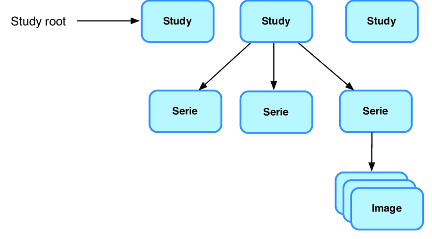

# SQL task

In this task, you will just write a bunch of SQL select statements. Store them anywhere and anyhow you seem appropriate
(e.g. create an `sql` folder and in it 3 `.sql` files). Do not store the results of the queries.


## Scenario
We have a large set of medical imaging data stored in a database. We have a specific need to filter out certain images 
based on different criteria.


## Data structure
You will be working with following tables:
- `aet` – AET (= Application Entity Title) is basically the name of our client (some hospital or clinic).
- `study`, `series`, `dicom_stow_rs` – These tables are related to the X-Ray scans that we receive from our clients. 
Each scan (DICOM) is contained in a series, and each series is part of a study, and together they form a hierarchy as 
seen in the figure below.
The `dicom_stow_rs` table contains metadata about the scan image itself.



- `prediction` – This table contains the results of our neural network predictions. Each scan can have multiple 
predictions (each pathology is predicted separately). Each prediction has a severity level (`ABNORMAL`, `SUSPECT`, 
`NORMAL`).


## Task

### Database Querying and Filtering
Connect to the given database (credentials were provided by e-mail), and write an SQL query to complete the following 
tasks.

#### 1. Select the date of the first scan for each AET.
We want to know when we started receiving scans from each AET (only the date, not the whole datetime column!). 
Format the result as following:
```
+----+-----------+
|aet |first_scan |
+----+-----------+
|XYZ |2022-12-01 |
|ABC |2024-04-23 |
+----+-----------+
```

#### 2. How many scans were predicted as `ABNORMAL`, `SUSPECT`, and `NORMAL` for each AET.
Beware that each scan have N predictions and severity of a scan is determined by the most severe prediction (and they 
go in the following order by ascending priority: `NORMAL`, `SUSPECT` and `ABNORMAL`). And we want count and severity of 
scans, not predictions themselves.

Format the result as following: 
```
+---------+---------+------+
|aet_name |severity |count |
+---------+---------+------+
|XYZ      |ABNORMAL |687   |
|ABC      |ABNORMAL |43    |
|ABC      |NORMAL   |593   |
|ABC      |SUSPECT  |2     |
+---------+---------+------+
```

#### 3. How many scans has each AET sent us per month?
We have a need for monthly statistics about the number of scans we receive from each AET. So we need the number of 
scans each AET has sent us per month with average number of scans per month for each AET. Format the result as 
following:
```
+--------+---------+--------------+------------------+
|month   |aet_name |monthly_count |avg_monthly_count |
+--------+---------+--------------+------------------+
|2022-08 |ABC      |534           |513               |
|2022-09 |ABC      |493           |513               |
|2022-09 |XYZ      |1293          |1293              |
+--------+---------+--------------+------------------+
```
